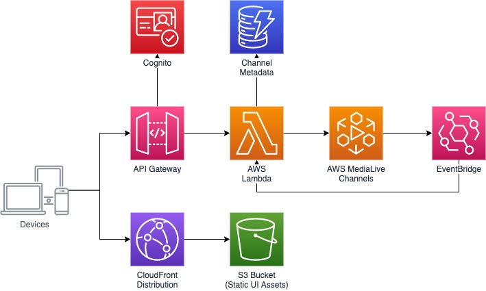

# AWS MediaLive Channel Orchestrator

## Contents

- [Overview](#overview)
- [High-level Diagram](#high-level-diagram)
- [User Guide](#user-guide)
- [Local Development](#local-development)

## Overview

This repository contains sample code to deploy a web app that can be used to
simplify the management of AWS MediaLive Channels. Supported functionality:
- [x] Start/Stop Channels
- [x] Input Switching
- [x] Motion Graphics Overlays
- [x] Channel Status
- [x] Output confidence monitoring
- [x] Media Package output autodiscovery
- [x] Input alerting
- [ ] Static Image Overlays
- [ ] Channel Scheduling

The CloudFormation template deploys the following resources:

- An Amazon S3 bucket to store the web app files (uploaded separately)
- An Amazon CloudFront distribution to serve the web app
- An Amazon API Gateway with an associated AWS Lambda function which
  implements the endpoints exposed to manage your MediaLive channels
- An Amazon Cognito user pool to provide authentication for the web app and API
- An Amazon DynamoDB table for storing data associated with channels (graphics, output streams)
- An AWS EventBridge rule for monitoring channel alerts with an associated
  AWS Lambda function for processing alerts

**Note:** You are responsible for the cost of the AWS services used while running this solution.
For full details, see the pricing pages for each AWS service you will be using in this sample.
Prices are subject to change.

## High-level Diagram

## User Guide

For details on how to configure and use the web application, consult the [user guide](./docs/USER_GUIDE.md).

## Local Development

For details on how to run and extend the web app locally, consult the [local development guide](./docs/LOCAL_DEVELOPMENT.md).

## Security

See [CONTRIBUTING](CONTRIBUTING.md#security-issue-notifications) for more information.

## License

This library is licensed under the MIT-0 License. See the LICENSE file.

